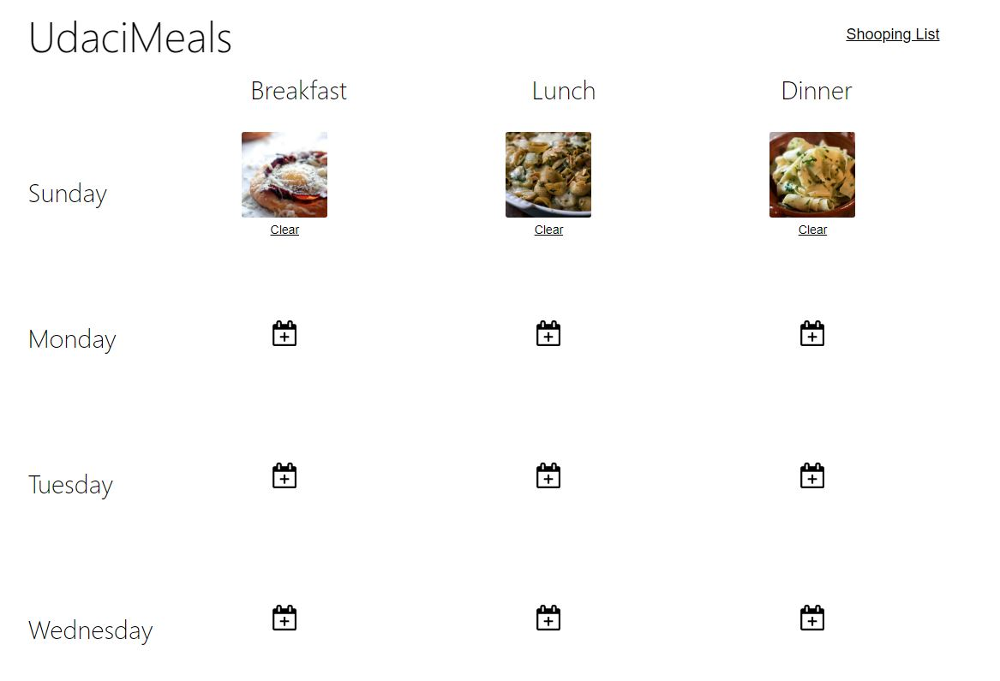
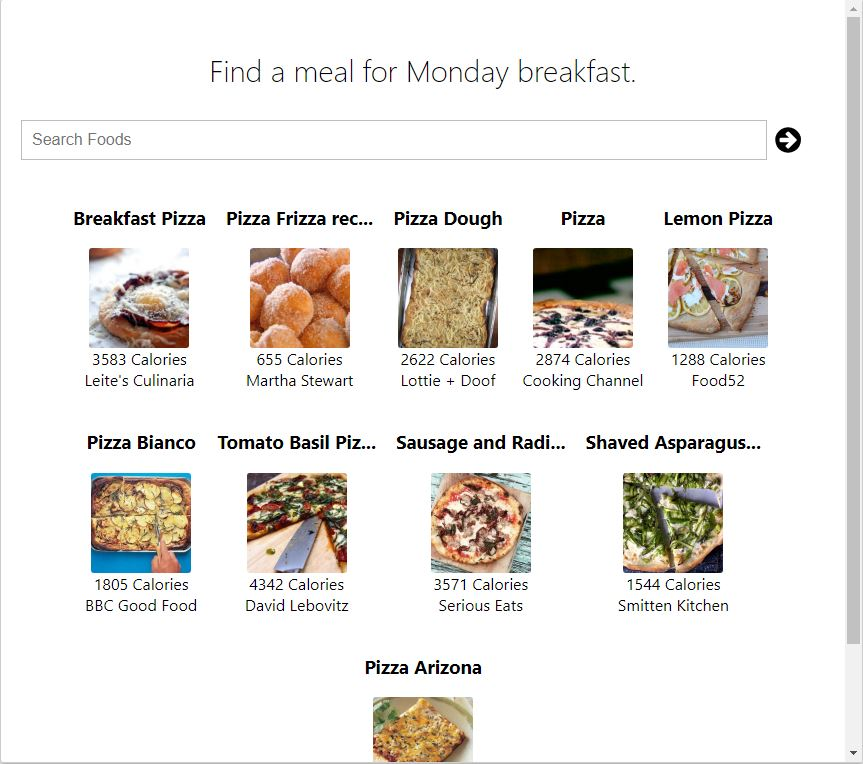

### UdaciMeals

O app  disponibiliza um calendário customizável para que usuários controlem seus cafés da manhã, almoços e jantas durante a semana. Os usuários aproveitarão a API Edamam de busca de receitas para adicionar as refeições, e assim gerar uma lista de compras baseada na refeição escolhida.

* cd udacimeals -- acesse a pasta
* npm install -- instalar pacotes
* npm start -- iniciar o aplicativo

