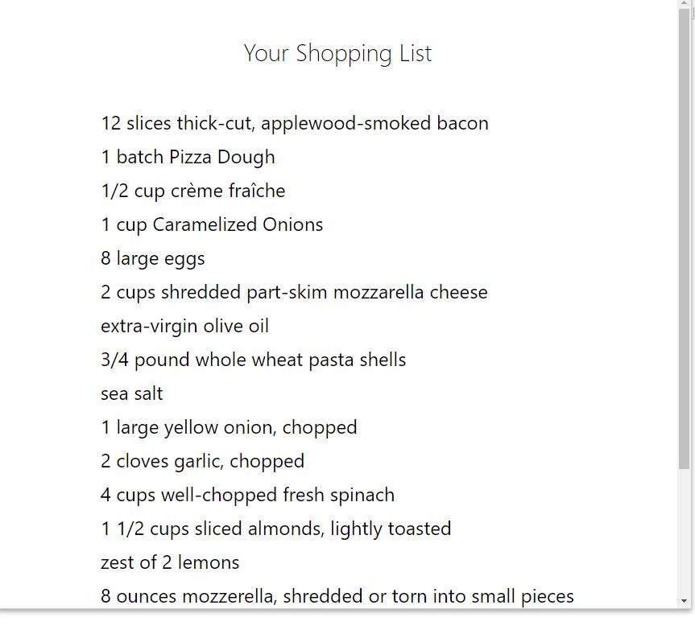

### UdaciMeals

The app provides a customizable calendar for users to control their breakfasts, lunches and dinners during the week. Users will take advantage of the Edamam recipe search API to add meals, thus generating a shopping list based on the chosen meal.

* cd udacimeals - access the folder
* npm install - install packages
* npm start - start the application

